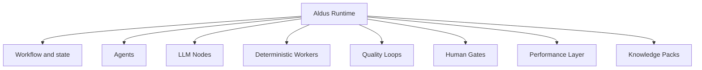
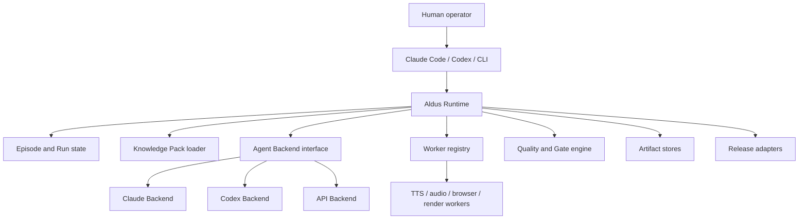
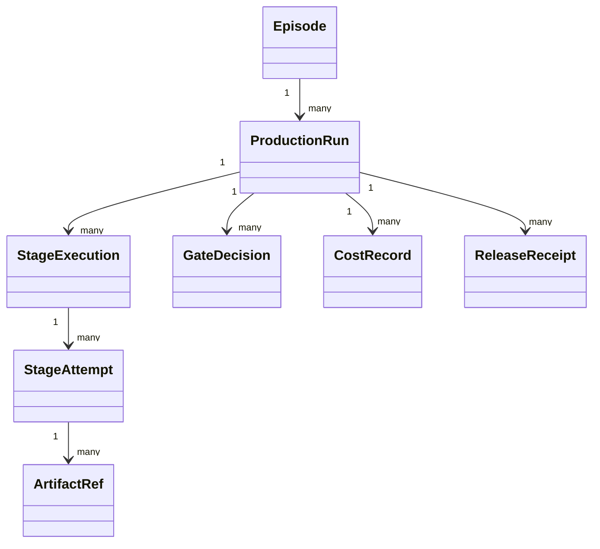
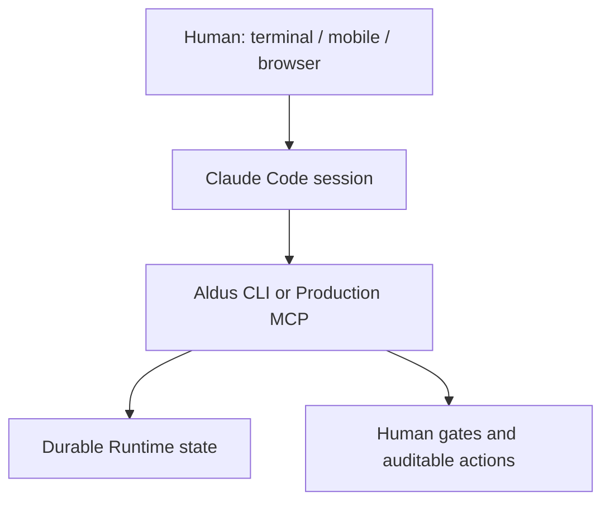
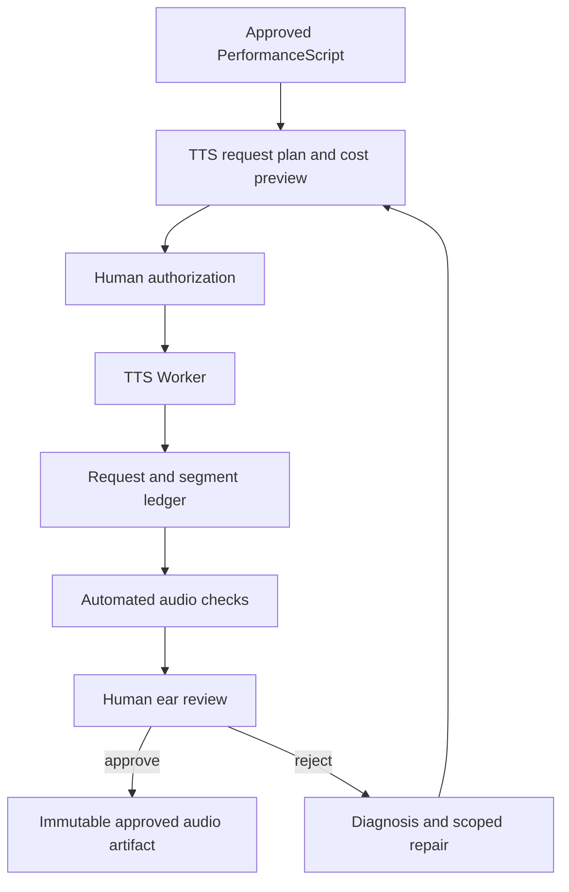
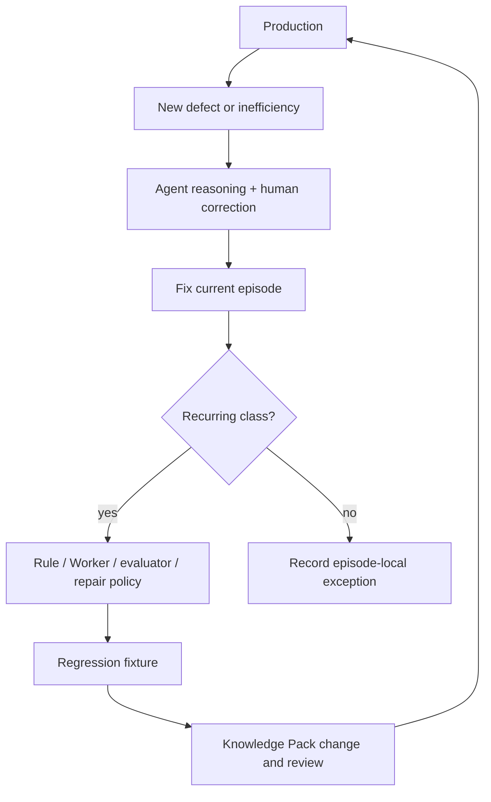

# Aldus AI Production Runtime

> General architecture specification  
> Status: Draft for implementation  
> Version: 0.2  
> Updated: 2026-08-18  
> Primary audience: development agents and maintainers

## 0. How to use this document

This is the canonical architecture document for **Aldus**, the general-purpose AI content production runtime currently being designed.

Normative terms are used deliberately:

- **MUST**: required for architectural correctness.
- **SHOULD**: expected unless an implementation-specific reason is recorded.
- **MAY**: optional extension.

The document defines **Aldus Runtime** as a generic, independently open-sourceable product. Adopter-specific knowledge, workers, credentials, storage, and release configuration MUST live outside the Runtime behind public contracts.

---

## 1. Product definition

Aldus is not a one-shot “topic to video” agent. It is:

> A runtime for producing versioned content artifacts through deterministic workers, bounded agentic reasoning, explicit quality loops, human decisions, and reusable production knowledge.

The first supported content forms are:

- long-form YouTube videos;
- podcasts;
- Shorts, Reels, and derivative formats;
- narrated videos using slides, screenshots, static images, and AI speech;
- multiple shows with different hosts, personas, voices, and editorial standards.

Aldus MUST support:

- multiple interchangeable Agent Backends, including Claude Code, Codex, and API agents;
- interactive human-in-the-loop production;
- resumable execution across sessions;
- versioned and private Knowledge Packs;
- deterministic Workers for repeatable operations;
- explicit quality gates and repair loops;
- traceable artifacts, costs, approvals, and release results;
- local-first operation without making local files the only possible storage model;
- a clean boundary between open runtime code and private production intelligence.

### 1.1 V1 goals

V1 MUST make interactive productions materially easier to inspect, resume, approve, and repair. It SHOULD reduce:

- uncertainty about the current episode state;
- duplicate or unnecessary paid TTS requests;
- loss or overwrite of accepted audio takes;
- repeated manual detection of known defect classes;
- dependence on an individual Claude Code session remembering prior work;
- unsafe all-or-nothing publish operations.

### 1.2 Non-goals

V1 is not intended to:

- replace all production scripts with a new orchestration framework;
- automate every subjective editorial decision;
- provide a custom web chat interface;
- migrate an existing production pipeline as a prerequisite for using the core contracts;
- require Firestore, Cloud Run, Google Drive, or a particular cloud;
- prescribe YouTube or Podcast as the only release targets;
- convert all production knowledge into YAML or a database;
- guarantee that a TTS seed reproduces identical audio;
- extract a separate open-source repository before the internal boundary is proven.

---

## 2. Naming and design intent

The code name **Aldus** references Aldus Manutius and the idea of treating editing, typography, production technology, portable formats, and distribution as one coherent publishing system.

The name expresses the intended scope: Aldus coordinates a production system. It is not itself the author, host, voice provider, renderer, or publishing platform.

---

## 3. Core design principles

### 3.1 The Agent is not the production system

Do not implement:

```text
Topic → Giant Agent → video.mp4
```

Implement explicit responsibilities:



Agents handle uncertainty and dynamic judgment. The Runtime owns control flow and durable state.

### 3.2 Worker before Agent

If a task can be made deterministic, repeatable, testable, and inexpensive, it SHOULD be implemented as a Worker.

Examples:

- FFmpeg rendering;
- TTS API invocation;
- audio normalization;
- screenshot capture;
- image cropping;
- caption conversion;
- file upload;
- checksum generation;
- schema and sync validation.

### 3.3 LLM Node before autonomous Agent

Use an LLM Node when a bounded transformation is enough:

- Host Adapter;
- Listening Evaluator;
- Persona QA;
- Performance Tagger;
- Summarizer;
- Claim Classifier;
- Conversational Editor.

An LLM Node MUST have structured input and output. It SHOULD NOT own workflow control.

### 3.4 Files and Runtime state are authoritative; session memory is not

No Claude Code, Codex, or API-agent session may be the sole storage location of production state, decisions, or approved artifacts.

### 3.5 Quality is a loop, not a final checkbox

Every important quality dimension SHOULD define:

```text
observe → diagnose → repair → verify → record
```

### 3.6 Human review is a first-class operation

Human review MUST create a durable `GateDecision`. A chat message saying “looks good” is not enough unless it is translated into a recorded decision tied to exact inputs.

### 3.7 Existing production capability is wrapped before it is rewritten

Adoption SHOULD follow a strangler pattern:

```text
observe existing command
→ wrap as Aldus stage
→ record artifacts and decisions
→ own retry/resume
→ refactor internals only when justified
```

---

## 4. System boundary



### 4.1 Aldus Core owns

- workflow and stage contracts;
- Episode, Run, Stage Attempt, Artifact, Gate, and Release models;
- state transitions;
- idempotency, retry, resume, and cancellation semantics;
- policy evaluation;
- Agent Backend and Worker interfaces;
- Knowledge Pack discovery and precedence;
- audit events and cost records;
- CLI and Production MCP semantics.

### 4.2 Aldus Core does not own

- show identities or host personas;
- private editorial rules;
- provider account credentials;
- adopter-specific filenames or Markdown conventions;
- a particular TTS voice or model;
- YouTube channel IDs or podcast feeds;
- Grassway data semantics;
- private source material.

### 4.3 Integration owns

- Show and Host Knowledge Packs;
- source and research adapters;
- current production scripts wrapped as Workers;
- provider and release configuration;
- show-specific quality checks;
- private artifacts and credentials;
- mappings between legacy episode paths and canonical Aldus identities.

Dependency direction MUST remain:

```text
Adopter Integration → Aldus public contracts
Aldus Core -X→ adopter code or private knowledge
```

---

## 5. Execution profiles

Aldus defines two profiles but only one is required for V1.

### 5.1 Interactive Editorial Profile — V1

Characteristics:

- initiated and supervised by a human or interactive agent;
- iterative editing and partial reruns;
- explicit content, performance, listening, and release gates;
- local workspace and Git-friendly;
- compatible with Claude Code Remote Control;
- long pauses between stages are normal.

This profile is the V1 implementation target.

### 5.2 Autonomous Scheduled Profile — future

Characteristics:

- scheduler or event initiated;
- stronger lease, queue, retry, and dead-letter requirements;
- exception-oriented human intervention;
- potentially post-publication review.

V1 contracts MUST NOT prevent this profile, but V1 MUST NOT build it without a concrete adopter need.

---

## 6. Domain model

Episode and execution state MUST be separated.



### 6.1 Episode

An Episode is the durable content identity. It is not a folder and not an execution attempt.

Required fields:

```ts
interface EpisodeRef {
  schemaVersion: string;
  episodeId: string;
  showId: string;
  title?: string;
  legacyRef?: string;
}
```

Example canonical IDs:

```text
show:{show-id}:episode:{episode-slug}
series:{series-id}:edition:{edition-id}
```

### 6.2 Production Run

A Run is one attempt to move an Episode through part or all of a workflow.

```ts
interface RunManifest {
  schemaVersion: string;
  runId: string;
  episode: EpisodeRef;
  workflowId: string;
  workflowVersion: string;
  status: "created" | "running" | "waiting" | "failed" | "completed" | "cancelled";
  currentStage?: string;
  codeRevision?: string;
  knowledgePacks: KnowledgePackRef[];
  createdAt: string;
  updatedAt: string;
}
```

### 6.3 Stage Execution and Attempt

A Stage Execution represents a logical stage in a Run. An Attempt is one invocation.

```ts
interface StageAttempt {
  attemptId: string;
  stageId: string;
  attempt: number;
  status: "queued" | "running" | "waiting_for_gate" | "failed" | "succeeded" | "cancelled";
  actor: ActorRef;
  inputArtifacts: ArtifactRef[];
  outputArtifacts: ArtifactRef[];
  startedAt?: string;
  finishedAt?: string;
  error?: StructuredError;
}
```

Attempts MUST be append-only audit records. A materialized manifest MAY summarize the current state.

### 6.4 Event log

Every state mutation MUST emit an immutable event containing:

- event ID and schema version;
- timestamp;
- Episode and Run IDs;
- actor and backend;
- action;
- previous and resulting state where relevant;
- input and output references;
- idempotency key;
- safe error detail.

---

## 7. Storage contracts

Core models MUST be independent of physical storage.

```ts
interface EpisodeStore {}
interface RunStore {}
interface ArtifactStore {}
interface EventStore {}
interface SecretResolver {}
```

V1 SHOULD implement:

- `FileEpisodeStore`;
- `FileRunStore` using `run.json` plus `events.jsonl`;
- `LocalArtifactStore`;
- an adapter hook for external archive storage.

Future implementations MAY include Firestore, PostgreSQL, GCS, S3, or Drive. Those MUST remain adapters rather than core assumptions.

Recommended local layout:

```text
.aldus/
  episode.json
  runs/
    {run-id}/
      run.json
      events.jsonl
      artifacts.json
      approvals.json
      costs.json
      release.json
```

---

## 8. Artifact model

Artifacts are the stable boundary between stages.

```ts
interface ArtifactRef {
  schemaVersion: string;
  artifactId: string;
  kind: string;
  uri: string;
  sha256: string;
  mediaType: string;
  sizeBytes?: number;
  producerRunId: string;
  producerStageId: string;
  inputHashes: string[];
  reconstructability: "source" | "reproducible" | "irreplaceable";
  createdAt: string;
}
```

### 8.1 Artifact rules

- Path or filename MUST NOT be treated as identity.
- Approved artifacts MUST be addressed by ID and hash.
- Every stage MUST declare inputs and outputs.
- An artifact MUST record which stage, run, code revision, and configuration produced it.
- Irreplaceable artifacts MUST be archived before disposable working files are cleaned.
- Provider seed MUST be recorded but MUST NOT be treated as a reproducibility guarantee.
- Generic names such as `req-00.wav` MUST NOT overwrite accepted audio from another Episode.

### 8.2 Canonical content artifacts

Content SHOULD move through explicit forms:

```text
EpisodeBrief
→ ResearchPack
→ CanonicalScript
→ HostNarration
→ ApprovedNarration
→ PerformanceScript
→ TTSRequestPlan
→ ApprovedAudio
→ Storyboard
→ RenderManifest
→ ReleaseBundle
```

Each form MUST be versionable and inspectable.

---

## 9. Show, Host, and Knowledge Packs

Show and Host are separate dimensions.

- **Show Pack**: editorial purpose, audience, format, episode structure, release conventions.
- **Host Pack**: persona, vocabulary, rhythm, stance, speaking style, pronunciation preferences.
- **Provider Pack**: voice, model, tag mapping, request limits, known failure modes.
- **Quality Pack**: lint rules, evaluators, diagnosis taxonomy, repair policies, fixtures.
- **Release Pack**: platform configuration and release policy.

### 9.1 Knowledge Pack contract

Knowledge MAY remain Markdown, fixtures, scripts, examples, and tests. A lightweight manifest SHOULD index it:

```yaml
id: example-show-editorial
version: 1
scope:
  show: example-show
authority: normative
includes:
  - SOP.md
  - writing-style.md
tests:
  - tests/example-show-editorial.test.ts
```

Every loaded pack SHOULD expose:

- identity and version;
- scope;
- authority (`normative`, `advisory`, `example`, `deprecated`);
- dependencies;
- precedence;
- included resources;
- tests or fixtures;
- source revision.

### 9.2 Precedence

Default precedence is:

```text
global
→ show
→ host
→ provider / voice / model / script form
→ episode override
```

Conflicts MUST be detectable. Silent last-write-wins behavior SHOULD be avoided for normative rules.

### 9.3 Negative knowledge

Known failed approaches, unsafe transformations, evaluator blind spots, and provider limitations SHOULD be first-class pack content. Learning does not mean storing only successful examples.

---

## 10. Agent Backend and capability model

The Runtime MUST NOT equal Claude Code or Codex.

```ts
interface AgentBackend {
  id: string;
  capabilities(): Promise<AgentCapabilities>;
  execute(request: AgentRequest): Promise<AgentResult>;
  resume?(session: AgentSessionRef, request: AgentRequest): Promise<AgentResult>;
  cancel?(executionId: string): Promise<void>;
}
```

Capabilities SHOULD declare:

- interactive or headless operation;
- filesystem and worktree access;
- available tools and MCP servers;
- structured-output support;
- resumability;
- maximum duration;
- permission and confirmation requirements;
- cost or token budget support.

### 10.1 Claude Code Backend

Claude Code is a first-class interactive backend because it can use the existing workspace, filesystem, tools, MCP servers, and project configuration.

Claude Code MAY:

- interpret natural-language operator requests;
- inspect Runtime state;
- invoke CLI or MCP operations;
- perform bounded reasoning stages;
- explain pending gates;
- propose repairs.

Claude Code MUST NOT be:

- the only state store;
- the sole audit trail;
- implicitly authorized to incur paid TTS cost;
- implicitly authorized to publish;
- relied on to remember approvals across sessions.

### 10.2 Remote Control

Claude Code Remote Control is an interaction surface, not an architectural dependency.



If Remote Control changes or disappears, Aldus MUST remain operable through its core API and CLI.

---

## 11. Workflow and stage contracts

A workflow is a versioned graph of stages and gates. It MUST be data-driven enough to inspect but need not be a universal visual DAG language in V1.

```ts
interface StageDefinition<I, O> {
  id: string;
  version: string;
  inputSchema: unknown;
  outputSchema: unknown;
  requiredCapabilities: string[];
  costPolicy?: CostPolicy;
  retryPolicy?: RetryPolicy;
  execute(context: StageContext, input: I): Promise<O>;
}
```

Each stage MUST:

- validate its declared inputs;
- produce declared outputs or a structured failure;
- be idempotent or explicitly declare why it is not;
- record the exact configuration used;
- expose safe retry behavior;
- avoid hidden mutation outside declared outputs;
- stop at required gates.

Large existing scripts MAY initially be wrapped as coarse stages. Stage boundaries SHOULD become finer only when partial retry, observability, reuse, or quality control justifies it.

---

## 12. Quality model

Quality mechanisms have four levels:

1. **Hard deterministic gate** — blocks on objectively testable failure.
2. **Advisory signal** — reports a possible issue without blocking.
3. **Model-assisted semantic review** — evaluates meaning, stance, style, or claims with uncertainty.
4. **Human oracle** — owns subjective judgment or asymmetric-risk decisions.

Examples:

| Check                                | Default level                 |
| ------------------------------------ | ----------------------------- |
| Missing required artifact            | Hard gate                     |
| Caption/audio sync outside tolerance | Hard gate                     |
| Paid request exceeds authorization   | Hard gate                     |
| Possible awkward rhythm              | Advisory                      |
| Stance or claim distortion           | Model-assisted + human review |
| Final host performance quality       | Human oracle                  |

Machine pass MUST NOT be presented as semantic correctness.

An evaluator that could not execute, could not parse its inputs, or could not produce a valid
report MUST cause an operational failure. An evaluator that executed successfully and found a
content problem MUST produce an **evaluation result**, and MUST NOT encode that finding as an
indistinguishable internal error. Production trace MUST allow "the evaluator failed" and "the
evaluator found a defect" to be told apart.

Whether an evaluation result stops work is governed by the declared enforcement for that finding's
class and by §12.1, never by the evaluator itself. A finding whose class has no declared
enforcement MUST be refused rather than assigned a default.

### 12.1 Evaluator promotion policy

An evaluator MAY become blocking only after it is calibrated against human-labeled examples. Promotion SHOULD consider:

- recall;
- false-positive rate;
- severity-weighted false negatives;
- asymmetric harm caused by unnecessary automatic correction;
- show, host, voice, model, and script-form scope;
- known blind spots.

### 12.2 Listener view

Listening evaluation SHOULD judge the experience of hearing the content rather than only reading the script. Relevant dimensions include:

- clarity without visual context;
- information density;
- rhythm and sentence length;
- transitions and callbacks;
- host persona;
- pronunciation and homophones;
- emotional and rhetorical intent.

### 12.3 Diagnosis taxonomy

Findings SHOULD be structured, for example:

```text
semantic / stance / unsupported claim
structure / repetition / transition
persona / tone / register
performance / pause / emphasis / emotion
pronunciation / homophone / named entity
audio / clipping / silence / pace / provider artifact
visual / storyboard / caption sync
release / metadata / platform state
```

### 12.4 Repair policy

Every repair SHOULD identify the smallest safe layer:

- regenerate only the affected TTS segment;
- change provider mapping without rewriting content;
- change PerformanceScript without altering approved claims;
- revise narration and invalidate dependent approvals;
- escalate to human rather than applying a risky semantic rewrite.

---

## 13. Human gates and freezes

A Gate Decision MUST include:

```ts
interface GateDecision {
  gateId: string;
  runId: string;
  decision: "approved" | "rejected" | "changes_requested" | "waived";
  subjectHashes: string[];
  decidedBy: ActorRef;
  decidedAt: string;
  comment?: string;
  expiresOnChange: boolean;
}
```

### 13.1 Content Freeze

Content Freeze approves the exact spoken content, claims, structure, and host narration. Any content-changing edit MUST invalidate it and downstream approvals.

### 13.2 Performance Freeze and TTS Authorization

Paid TTS MUST NOT run until the operator approves:

- spoken-text hash;
- PerformanceScript hash;
- voice, model, and relevant settings;
- request plan or segment scope;
- maximum authorized cost.

The authorization MUST be invalidated if any bound value changes.

### 13.3 Human Ear Gate

Automated checks MAY filter and prioritize candidates, but final performance approval remains human-owned until a scoped evaluator is demonstrably reliable.

### 13.4 Final Release Gate

Release approval MUST bind to the final render, captions, metadata, destination, and visibility policy. Uploading and making public SHOULD be separate operations.

---

## 14. Performance Layer

The Performance Layer sits between approved narration and TTS provider requests.

```text
ApprovedNarration
→ PerformanceScript
→ provider-specific mapping
→ exact TTS request
```

### 14.1 PerformanceScript

PerformanceScript SHOULD describe intent independently of provider syntax:

```ts
interface PerformanceSegment {
  segmentId: string;
  spokenText: string;
  intent?: string;
  pace?: "slow" | "normal" | "fast";
  emphasis?: string[];
  pauses?: Array<{ after: string; strength: number }>;
  emotion?: string;
  pronunciationRefs?: string[];
}
```

Provider adapters map this representation into ElevenLabs or other provider request formats.

### 14.2 Incremental adoption

An adopter MAY continue authoring Audio Tags inside its current format initially. An adapter SHOULD parse the legacy format into a derived PerformanceScript. The source format SHOULD change only after the structured representation has proven stable.

### 14.3 Performance Tagger

The Tagger MAY suggest performance intent, but its output MUST remain inspectable. For paid synthesis, generated tags are subject to Performance Freeze.

### 14.4 Performance telemetry

Record:

- original and tagged text;
- inferred intent;
- provider mapping;
- human edits;
- accepted/rejected takes;
- reason for rejection;
- voice, model, settings, request ID, seed, cost, and audio hash.

---

## 15. TTS quality loop and ledger



Each request or segment record MUST contain:

- segment ID;
- raw, normalized, substituted, tagged, and final provider text where applicable;
- voice, model, settings, seed;
- provider request ID;
- charged or estimated cost;
- output URI and SHA-256;
- risk sites and ASR findings;
- human decision and reason;
- fallback or regeneration lineage.

Text and parameters on a take record what was **planned**, because they are assigned before the
adapter runs. Where an adapter is not the planned provider, or sends something other than what it
was handed, it MUST be able to report what it actually did, and that report MUST be stored beside
the planned values rather than replacing them. Absence of such a report means the adapter did not
report; it MUST NOT be read as the plan having been followed.

A comparison required by §13.2 between what an operator approved and what was sent MUST use the
reported value. Comparing the planned value against the approval compares the plan with itself.

### 15.1 Repair strategies

Repairs MAY include:

- pronunciation substitution scoped to voice/model/script form;
- punctuation or pause mapping;
- segmentation adjustment;
- provider setting change;
- alternate take generation;
- narration rewrite with Content Freeze invalidation;
- human-recorded replacement.

Rejected paid takes SHOULD be retained with unique identity until retention policy allows cleanup. Aldus MUST NOT silently retry paid requests without policy and cost authorization.

### 15.2 TTS lexicon

Lexicon entries SHOULD support:

- written and spoken forms;
- scope by show, host, provider, voice, model, language, and script form;
- authority and approval status;
- risk-site annotations;
- examples and regression fixtures;
- provenance and version.

---

## 16. Storyboard, rendering, and visual artifacts

Storyboard converts approved content and audio timing into explicit visual intent. It SHOULD reference artifacts rather than hiding media selection inside a renderer.

The renderer MUST be as deterministic and “dumb” as practical:

```text
RenderManifest + assets + approved audio
→ deterministic render
→ video artifact + technical report
```

The renderer SHOULD NOT make editorial decisions, rewrite text, choose claims, or silently substitute missing assets.

---

## 17. Release and distribution

Publishing is a domain, not a single command.

```ts
interface ReleaseReceipt {
  releaseId: string;
  destination: string;
  operation: string;
  idempotencyKey: string;
  status: "succeeded" | "failed" | "pending" | "skipped";
  remoteId?: string;
  remoteUrl?: string;
  inputHashes: string[];
  completedAt?: string;
  error?: StructuredError;
}
```

A `ReleaseBundle` MAY contain operations for:

- media upload;
- captions;
- thumbnail;
- title and description;
- privacy transition;
- playlist;
- podcast storage and RSS;
- notification channels.

Each operation MUST be independently idempotent and resumable where the platform allows it. Pre-release hard gates and post-upload best-effort operations MUST be distinguished.

Upload, review in platform UI, and public release SHOULD be separate states.

---

## 18. CLI and Production MCP

Core behavior MUST be available through a programmatic API. CLI and MCP are adapters over the same application services.

V1 CLI target:

```bash
aldus init
aldus status
aldus inspect <episode-or-run>
aldus run <stage>
aldus approve <gate>
aldus reject <gate>
aldus retry <stage-or-attempt>
aldus artifacts
aldus costs
aldus release status
```

Production MCP SHOULD expose equivalent typed operations.

### 18.1 Data MCP vs Production MCP

Data-source MCP servers and production-control MCP servers MUST remain separate trust boundaries.

- Read-oriented data tools MAY be broadly available.
- Mutating production tools MUST validate workspace, Episode, Run, actor, permissions, idempotency, and relevant approvals.
- Paid synthesis and publishing operations MUST require explicit scoped authority.

---

## 19. Reliability, security, and governance

### 19.1 Reliability

Aldus MUST define:

- idempotency keys for external side effects;
- concurrency and lease semantics;
- retry classification and limits;
- cancellation behavior;
- recovery from partial success;
- stale-run detection;
- structured errors;
- schema migration policy.

V1 local interactive execution MAY use simple file locking. The contract MUST allow stronger distributed leases later.

### 19.2 Security

- Secrets MUST be referenced, not embedded in manifests or logs.
- Agent Backends MUST receive tool and path allowlists.
- Mutating actions MUST record actor identity.
- Logs MUST redact credentials and sensitive request headers.
- Worktree or workspace binding MUST be explicit.
- Private Knowledge Packs MUST never be required by Aldus Core tests or distributions.

### 19.3 Cost governance

Cost-incurring stages MUST support:

- dry-run or cost preview where possible;
- per-request and per-run limits;
- explicit spend authorization;
- actual cost recording;
- stop-on-budget behavior;
- safe handling of unknown provider billing status.

---

## 20. Production trace and learning loop

Production trace MUST answer:

- what happened;
- who or what performed it;
- which inputs, code, packs, and configuration were used;
- what it cost;
- what was approved or rejected;
- which artifact became canonical;
- what can be retried safely;
- what production knowledge should change.



Git and pull requests remain useful for reviewing Runtime code and file-backed Knowledge Packs. Git is not a substitute for Run state, external release receipts, or artifact archives.

---

## 21. Repository and open-source boundary

Recommended logical packages:

```text
packages/
  aldus-core/
  aldus-cli/
  aldus-mcp/
  aldus-file-store/
  aldus-testkit/

integrations/
  example-studio/
    shows/
      show-a/
      show-b/
    workers/
    release/
```

This layout is logical, not an instruction for an immediate repository move.

The first implementation SHOULD live as an internal package or workspace alongside the adopter until:

- more than one show or integration uses the contracts;
- core code has no adopter-specific imports;
- private packs can be absent from core tests;
- provider-specific behavior is behind interfaces;
- at least one alternative adapter or test double proves substitutability.

Only then SHOULD Aldus be extracted into a separate open-source repository.

---

## 22. Initial implementation work packages

These packages are intended to support parallel assignment after core schemas are agreed.

### WP-01 Core schema and testkit

- TypeScript domain types;
- JSON schemas and validators;
- ID generation;
- schema-version fixtures;
- redaction helpers;
- test builders.

Dependencies: none.

### WP-02 File state and event store

- atomic manifest writes;
- append-only JSONL events;
- file locking;
- materialized current state;
- recovery from interrupted writes.

Dependencies: WP-01.

### WP-03 Artifact registry

- SHA-256 and metadata collection;
- reconstructability policy;
- archive adapter;
- collision-safe paths;
- lineage queries.

Dependencies: WP-01, WP-02.

### WP-04 Stage runner

- stage definition and registry;
- lifecycle events;
- input/output validation;
- retry and idempotency policy;
- cancellation and structured errors.

Dependencies: WP-01, WP-02.

### WP-05 Gate and authorization engine

- Gate Decisions;
- hash-bound approval invalidation;
- Content and Performance Freeze;
- spend grants;
- release approval.

Dependencies: WP-01, WP-02.

### WP-06 Integration shadow recorder

- episode identity adapter;
- wrappers around current adopter commands;
- safe parameter capture;
- Git/config/pack snapshots;
- no behavior change.

Dependencies: WP-01, WP-02; may proceed in parallel with WP-03 after interfaces settle.

### WP-07 TTS ledger and artifact adoption

- request and segment manifests;
- billing and request-ID capture;
- accepted/rejected take lineage;
- pronunciation risk annotations;
- irreplaceable audio archival.

Dependencies: WP-03, WP-05, WP-06.

### WP-08 CLI

- status and inspect first;
- run, approve, reject, retry second;
- machine-readable JSON output;
- human-readable summaries.

Dependencies: WP-02, WP-04, WP-05.

### WP-09 Knowledge Pack loader

- manifests;
- scope and precedence;
- conflict reporting;
- pack snapshot in Run Manifest;
- compatibility with current Markdown and fixtures.

Dependencies: WP-01; can proceed in parallel with WP-02–05.

### WP-10 Regression harness

- defect corpus schema;
- human/evaluator comparison;
- scope-aware metrics;
- promotion report;
- known-blind-spot registry.

Dependencies: WP-01, WP-09.

### WP-11 Production MCP

- typed read operations;
- capability-checked mutations;
- workspace binding;
- audit integration;
- Claude Code usage guide.

Dependencies: WP-04, WP-05, WP-08.

### WP-12 Release adapters

- Release Bundle and Receipt;
- resumable YouTube operations;
- caption, thumbnail, playlist, podcast, and notification adapters;
- external-state reconciliation.

Dependencies: WP-03, WP-04, WP-05.

### WP-13 Worker seam

- `Worker` contract with stable id and exactly-resolved version;
- capability declaration and a pre-execution check that fails closed;
- `WorkerRegistry`, with no implicit latest-version selection;
- a runtime-owned path from a Stage to a registered Worker;
- Worker id, version and checked capabilities in production trace;
- test doubles and adopter-facing testkit helpers.

§3.2 makes "Worker before Agent" design principle #2 and §4.1 assigns the interface to Core, but
no work package claimed it, so only the Agent half was built. The contract told adopters to prefer
the seam that did not exist. Added after the first adopter reached the point where it decided a
month of their work (#111).

A Worker performs a declared operation. Validation, gates, retry, idempotency, cost authorization,
artifact provenance and attempt state stay with the Stage — a Worker that acquired them would be a
second workflow abstraction competing with the first (ADR-0035).

Dependencies: WP-01, WP-04.

---

## 23. V1 priority order

1. Core schema and file-backed Run/Event state.
2. Read-only shadow recorder and `aldus status`.
3. Artifact lineage and accepted-audio safety.
4. Content Freeze, Performance Freeze, and spend authorization.
5. TTS request/segment ledger and human ear decisions.
6. Knowledge Pack indexing.
7. Stage wrappers and safe partial retry.
8. Regression harness.
9. Production MCP and Remote Control workflows.
10. Release receipts and resumable publishing.
11. Worker seam, so deterministic operations have the seam §3.2 tells adopters to prefer.

Web UI and autonomous scheduling are not V1 priorities.

---

## 24. V1 definition of done

Aldus V1 is complete when:

- multiple shows can initialize a canonical Episode and Run;
- an operator can see current state and next safe action without reading chat history;
- the current production scripts run through stage wrappers;
- exact artifacts, hashes, configuration, packs, and code revision are traceable;
- paid TTS cannot execute without valid hash-bound authorization;
- accepted TTS takes are immutable and recoverable;
- failed or rejected segments can be retried without repeating unaffected requests;
- Human Gate decisions survive Agent session changes;
- Claude Code Remote Control can inspect and operate the Runtime safely;
- a representative defect corpus is executed during regression testing;
- release operations produce resumable receipts;
- a deterministic operation can be implemented as a Worker and invoked by a Stage through the
  runtime, with its id, version and checked capabilities in the trace;
- every capability an adopter is expected to supply is reachable from a config module, not only
  from a directly constructed runtime object;
- Aldus Core imports no adopter-specific implementation;

---

## 25. Architecture decisions still open

The following require ADRs before or during implementation:

1. Exact package placement during the internal incubation period.
2. JSON Schema validator and schema-migration mechanism.
3. Event ordering and file-lock implementation for local concurrent sessions.
4. Artifact archive target for irreplaceable audio.
5. Stable canonical Episode ID rules for adopter history.
6. Whether PerformanceScript remains derived or becomes an authored artifact after V1.
7. Which current scripts should remain coarse Workers versus be decomposed.
8. Production MCP authentication and local permission model.
9. Minimum evaluator evidence required to promote an advisory check to a hard gate.
10. Exact extraction criteria and public package names.

Until decided, implementations SHOULD choose the smallest reversible option and record the assumption.

---

## 26. One-sentence summary

> Aldus is a general-purpose, human-centered AI production runtime that turns agents, deterministic workers, versioned production knowledge, explicit approvals, quality loops, and traceable artifacts into a reliable content production system.
