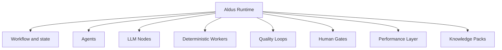
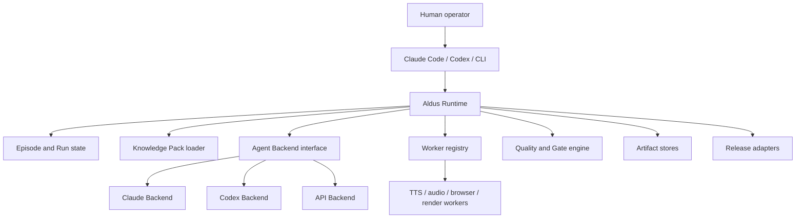
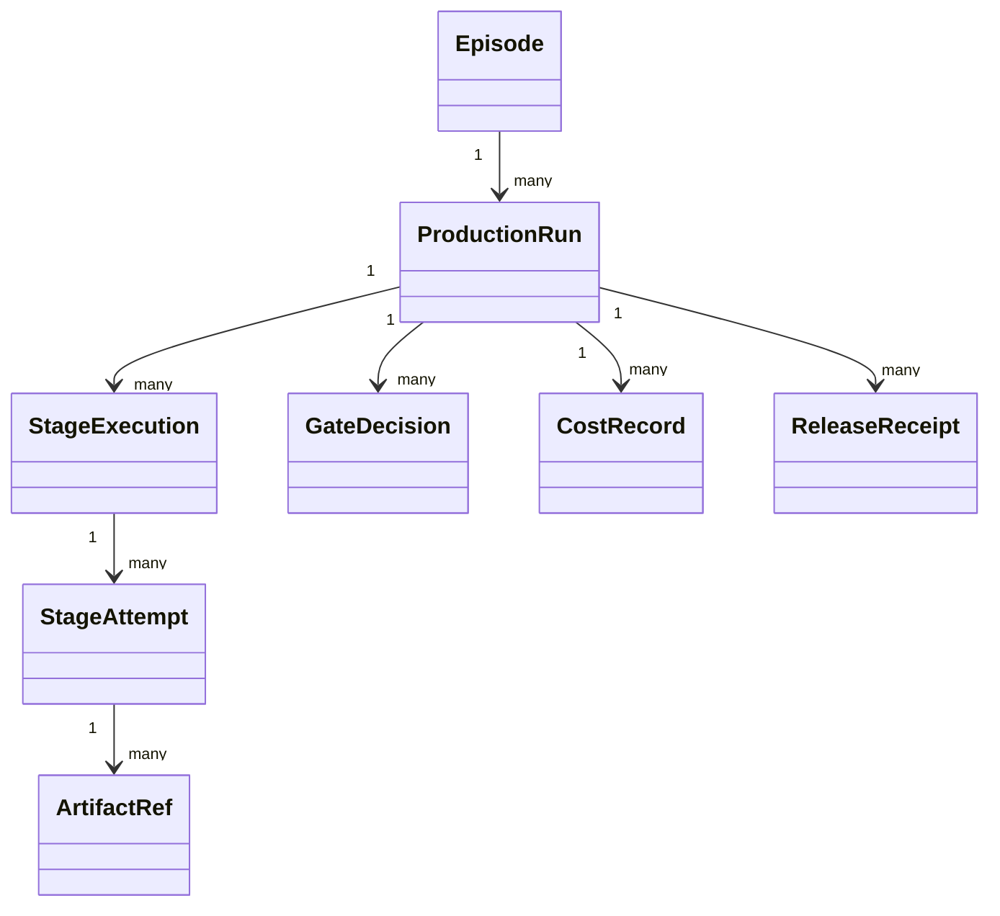
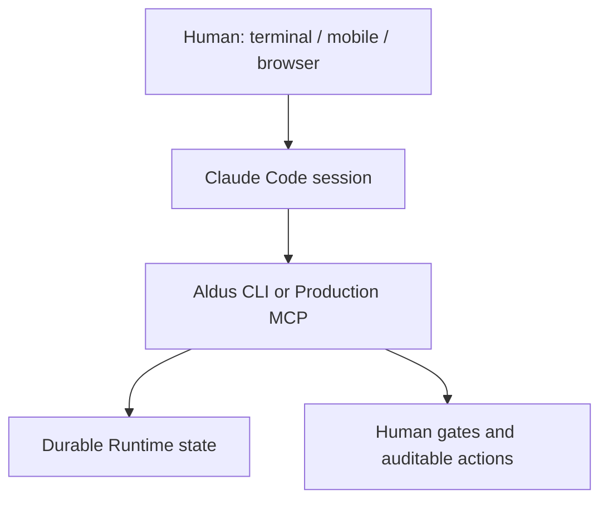
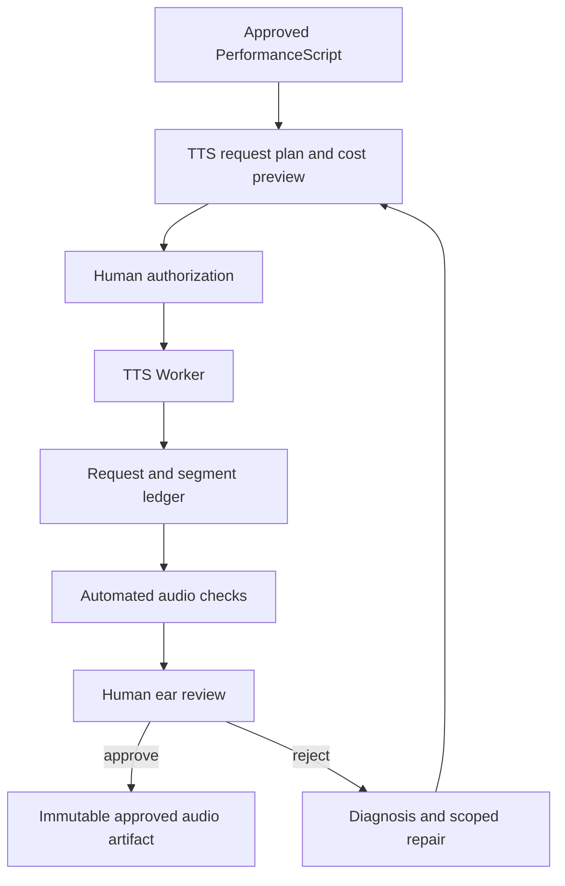
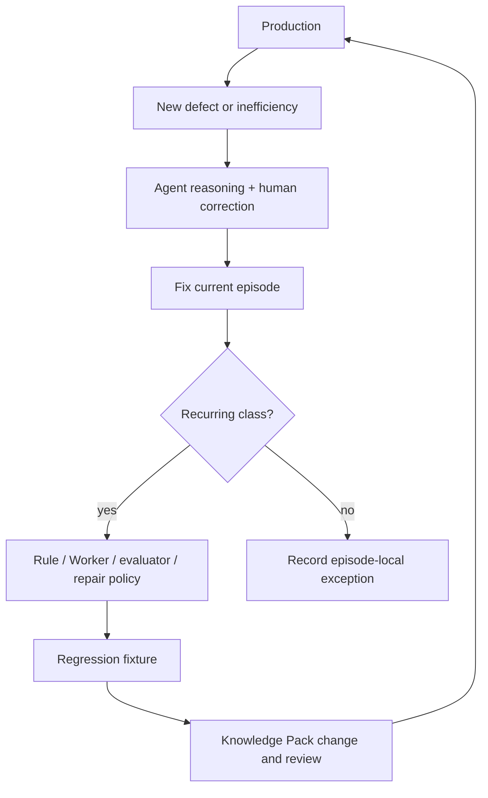

# Aldus AI Production Runtime

> 泛用架構規格  
> 狀態：可供實作的草案  
> 版本：0.2  
> 更新日期：2026-08-18  
> 主要讀者：開發者、開發 Agent 與維護者

## 0. 文件使用方式

本文件是 **Aldus** 的正式架構規格。Aldus 是一套泛用、可獨立開源的 AI 內容製作 Runtime。

文件中的規範用語：

- **MUST／必須**：架構正確性所需的必要條件。
- **SHOULD／應該**：除非有明確且被記錄的理由，否則應遵守。
- **MAY／可以**：選擇性擴充。

採用者專屬的知識、Worker、憑證、儲存方式與發布設定，必須透過公開契約放在 Runtime 之外。

---

## 1. 產品定位

Aldus 不是一個把題目一次性變成影片的巨大 Agent，而是：

> 透過確定性 Worker、受約束的 Agent 推理、明確品質迴圈、人類決策與可重用製作知識，持續產生可版本化內容 Artifact 的 Runtime。

第一批支援的內容形式包括：

- YouTube 長影片；
- Podcast；
- Shorts、Reels 與其他衍生格式；
- 以投影片、截圖、靜態圖片與 AI 語音為主的敘事影片；
- 多節目、多主持人、多種人設、聲音與編輯標準。

Aldus 必須支援：

- 可替換的 Agent Backend，包括 Claude Code、Codex 與 API Agent；
- 互動式 Human-in-the-loop 製作；
- 跨 session 暫停、恢復與局部重試；
- 可版本化、可保持私有的 Knowledge Pack；
- 適合重複工作的確定性 Worker；
- 明確 Quality Gate 與 Repair Loop；
- 可追蹤的 Artifact、成本、審核與發布結果；
- local-first，但不把本機檔案當成唯一儲存模型；
- 開源 Runtime 與私有 production intelligence 之間的乾淨邊界。

### 1.1 V1 目標

V1 必須讓互動式製作更容易檢查、恢復、審核與修復，並降低：

- 不知道目前做到哪裡的狀態混亂；
- 重複或不必要的付費 TTS；
- 已接受音檔被覆寫或遺失；
- 人工反覆尋找已知類型的錯誤；
- 對單一 Agent session 記憶的依賴；
- 無法局部恢復的全有或全無發布流程。

### 1.2 非目標

V1 不負責：

- 一開始就重寫所有既有製作腳本；
- 自動化所有主觀編輯判斷；
- 建立自有 Web Chat UI；
- 要求 Firestore、Cloud Run、Google Drive 或特定雲端；
- 假設 YouTube 或 Podcast 是唯一發布目的地；
- 把所有製作知識改寫成 YAML 或資料庫；
- 保證相同 TTS seed 能重現完全相同的音訊；
- 在內部邊界尚未證明前，過早拆出另一個 repository。

---

## 2. 命名與設計意圖

代號 **Aldus** 取自 Aldus Manutius，代表把編輯、字體、製作技術、可攜格式與發行視為一個完整出版系統。

Aldus 協調的是 production system。它本身不是作者、主持人、語音供應商、Renderer 或發布平台。

---

## 3. 核心設計原則

### 3.1 Agent 不等於 Production System

不要實作：

```text
Topic → Giant Agent → video.mp4
```

應明確拆分責任：



Agent 處理不確定性與動態判斷；Runtime 掌握 control flow 與 durable state。

### 3.2 Worker 優先於 Agent

若任務可以做成確定、可重複、可測試且低成本的操作，就應實作為 Worker，例如：

- FFmpeg rendering；
- TTS API invocation；
- audio normalization；
- screenshot capture；
- image crop；
- caption conversion；
- file upload；
- checksum、schema 與 sync validation。

### 3.3 LLM Node 優先於自主 Agent

若有界的語言轉換已足夠，應使用結構化輸入輸出的 LLM Node，例如 Host Adapter、Listening Evaluator、Persona QA、Performance Tagger、Summarizer 與 Claim Classifier。LLM Node 不應自行控制 Workflow。

### 3.4 Session memory 不是 Source of Truth

任何 Agent session 都不能成為 production state、審核決定或已核准 Artifact 的唯一儲存位置。

### 3.5 品質是一個迴圈

重要品質面向應定義：

```text
observe → diagnose → repair → verify → record
```

### 3.6 Human Gate 是一級操作

人類審核必須產生 durable `GateDecision`，並綁定精確輸入。聊天中的「OK」若沒有寫入 Runtime，不算正式批准。

### 3.7 先包裝，再重寫

導入既有系統時應採 strangler pattern：

```text
觀察既有命令
→ 包裝成 Aldus Stage
→ 記錄 Artifact 與決定
→ 接管 retry / resume
→ 有明確收益時才重構內部
```

---

## 4. 系統邊界



### 4.1 Aldus Core 負責

- Workflow 與 Stage 契約；
- Episode、Run、Stage Attempt、Artifact、Gate 與 Release model；
- state transition；
- idempotency、retry、resume 與 cancel semantics；
- policy evaluation；
- Agent Backend 與 Worker interface；
- Knowledge Pack discovery 與 precedence；
- audit event 與 cost record；
- CLI 與 Production MCP semantics。

### 4.2 Aldus Core 不負責

- 節目身份、主持人人設或私有編輯規則；
- provider 憑證；
- 採用者專屬檔名與內容格式；
- 特定 voice、model、channel 或 feed；
- 私有資料來源與 source material。

依賴方向必須保持：

```text
Adopter Integration → Aldus public contracts
Aldus Core -X→ adopter code or private knowledge
```

---

## 5. Execution Profile

### 5.1 Interactive Editorial Profile — V1

特性：

- 由人類或互動式 Agent 啟動與監督；
- 允許迭代編輯和局部重跑；
- 有 Content、Performance、Listening 與 Release Gate；
- 適合 local workspace 與 Git；
- 相容 Claude Code Remote Control；
- Stage 間長時間暫停是正常狀況。

這是 V1 的實作目標。

### 5.2 Autonomous Scheduled Profile — 未來

排程或事件驅動模式需要更完整的 lease、queue、retry 與 dead-letter。V1 契約不能阻止未來實作，但沒有具體需求時不必先建造。

---

## 6. Domain Model

Episode 與執行狀態必須分離。



### 6.1 Episode

Episode 是持久的內容身份，不是資料夾，也不是某一次執行。

```ts
interface EpisodeRef {
  schemaVersion: string;
  episodeId: string;
  showId: string;
  title?: string;
  legacyRef?: string;
}
```

### 6.2 Production Run

Run 是推進 Episode 通過部分或完整 Workflow 的一次嘗試。

```ts
interface RunManifest {
  schemaVersion: string;
  runId: string;
  episode: EpisodeRef;
  workflowId: string;
  workflowVersion: string;
  status: "created" | "running" | "waiting" | "failed" | "completed" | "cancelled";
  currentStage?: string;
  codeRevision?: string;
  knowledgePacks: KnowledgePackRef[];
  createdAt: string;
  updatedAt: string;
}
```

### 6.3 Stage Execution 與 Attempt

Stage Execution 表示邏輯階段；Attempt 表示其中一次呼叫。Attempt 必須保留為 append-only audit record，Runtime 可以另建 materialized manifest 顯示目前狀態。

每個 Stage 必須宣告：它不註冊任何 artifact，或一份 artifact contract。該 contract 必須在執行前解析，且只能取自已驗證的 input、已記錄的 configuration，以及宣告的 input artifacts。**Stage 的回傳值與它實際註冊的 artifacts 不得決定它應該產出什麼**——由結果推導出的義務必然被自身滿足。Resolver 不得取得檔案系統或任意 I/O；無法從已驗證的 invocation 推導出的 mode 是 hidden input，必須先被顯式化。

已解析的 contract 必須支援 cardinality：至少包含 kind 與最小數量，並可選最大數量。Artifact kind 仍為 adopter 自定義的 opaque string。已解析的 contract 必須記錄在 attempt 上，使 production trace 能說明 runner 當時期望什麼。

Attempt 結算為 succeeded 前，必須將已註冊的 artifacts 與已解析的 contract 比對。缺少必要 artifact、超出 cardinality，或註冊了 contract 未宣告的 kind，都必須產生結構化且不可重試的失敗。已註冊的 artifacts 必須保留以供診斷。Cancelled、failed 與 waiting-for-gate 的 attempt 不需滿足此 contract。

沒有宣告不得被讀成「沒有 artifact」。

外部效果的 idempotency key 必須識別「該筆可獨立去重的效果」，而非包含它的 attempt。Stage 若執行多筆此類效果，每一筆都必須自帶 key；同一個 key 不得重複用於多個目的地物件。

每一個 Stage 對 Worker 的請求都必須宣告該操作是否產生外部效果；有效果的請求必須攜帶其目的地用來去重的 key。**Invocation fingerprint 絕不得作為外部 idempotency key 提供**；沒有專屬於該效果的 key 時，正確值是「不存在」，而非 `runId`、attempt id、configuration digest 或空的 input-hash 集合。

Stage 必須宣告重跑它會對 workspace 之外造成什麼。重試決策必須讀取並呈現該宣告與其理由；僅記錄下來供日後稽核並不足夠。

### 6.4 Event Log

每個狀態變更必須寫入不可變事件，包括 event ID、schema version、時間、Episode／Run、actor、backend、action、輸入輸出、idempotency key 與安全的錯誤資訊。

---

## 7. Storage Contract

Core model 必須與實體儲存方式無關：

```ts
interface EpisodeStore {}
interface RunStore {}
interface ArtifactStore {}
interface EventStore {}
interface SecretResolver {}
```

V1 應實作 file-backed Episode／Run／Event Store、Local Artifact Store，以及外部 archive adapter hook。

建議本機結構：

```text
.aldus/
  episode.json
  runs/{run-id}/
    run.json
    events.jsonl
    artifacts.json
    approvals.json
    costs.json
    release.json
```

Firestore、PostgreSQL、GCS、S3 或 Drive 都只能是 adapter，不能成為 Core 假設。

---

## 8. Artifact Model

Artifact 是 Stage 間的穩定邊界。

```ts
interface ArtifactRef {
  schemaVersion: string;
  artifactId: string;
  kind: string;
  uri: string;
  sha256: string;
  mediaType: string;
  sizeBytes?: number;
  producerRunId: string;
  producerStageId: string;
  inputHashes: string[];
  reconstructability: "source" | "reproducible" | "irreplaceable";
  createdAt: string;
}
```

規則：

- 路徑或檔名不能當作 identity；
- 已批准 Artifact 必須以 ID 與 hash 識別；
- 每個 Stage 必須宣告 inputs 與 outputs；
- 必須記錄產生 Artifact 的 Stage、Run、code revision 與設定；
- irreplaceable Artifact 必須在清理工作檔前封存；
- provider seed 必須記錄，但不能視為重現保證；
- 通用檔名不得覆寫其他 Episode 的已接受音檔。

Canonical content flow：

```text
EpisodeBrief → ResearchPack → CanonicalScript → HostNarration
→ ApprovedNarration → PerformanceScript → TTSRequestPlan
→ ApprovedAudio → Storyboard → RenderManifest → ReleaseBundle
```

---

## 9. Show、Host 與 Knowledge Pack

- **Show Pack**：節目目的、受眾、格式、結構與發布慣例。
- **Host Pack**：人設、用詞、節奏、立場、口語風格與發音偏好。
- **Provider Pack**：voice、model、tag mapping、request limit 與已知問題。
- **Quality Pack**：lint、evaluator、diagnosis taxonomy、repair policy 與 fixture。
- **Release Pack**：平台設定與發布政策。

知識可以繼續存在 Markdown、fixture、script、example 與 test 中；只需用輕量 manifest 建立索引。

預設 precedence：

```text
global → show → host → provider / voice / model / script form → episode override
```

規範衝突必須可被偵測。已失敗的方法、危險轉換、evaluator 盲點與 provider 限制也應被視為正式知識。

---

## 10. Agent Backend 與 Capability Model

Runtime 不能等於 Claude Code 或 Codex。

```ts
interface AgentBackend {
  id: string;
  capabilities(): Promise<AgentCapabilities>;
  execute(request: AgentRequest): Promise<AgentResult>;
  resume?(session: AgentSessionRef, request: AgentRequest): Promise<AgentResult>;
  cancel?(executionId: string): Promise<void>;
}
```

Capability 應宣告 interactive/headless、filesystem/worktree、tools/MCP、structured output、resume、duration、permission 與 budget 支援。

Claude Code 可以解讀自然語言、檢查 Runtime state、呼叫 CLI／MCP、執行受限 reasoning stage、解釋待審 Gate 與提出修復建議；但不能是唯一 state store、唯一 audit trail，也不能自動取得付費 TTS 或發布權限。



Remote Control 是互動介面，不是架構依賴。

---

## 11. Workflow 與 Stage Contract

Workflow 是有版本的 Stage／Gate graph。V1 不需要先發明通用視覺 DAG 語言。

```ts
interface StageDefinition<I, O> {
  id: string;
  version: string;
  inputSchema: unknown;
  outputSchema: unknown;
  requiredCapabilities: string[];
  costPolicy?: CostPolicy;
  retryPolicy?: RetryPolicy;
  execute(context: StageContext, input: I): Promise<O>;
}
```

每個 Stage 必須驗證 input、產生宣告 output 或 structured failure、具備 idempotency 或明確揭露例外、保存精確設定、提供安全 retry，並在必要 Gate 停止。

大型既有腳本一開始可以是 coarse stage；只有 partial retry、observability、reuse 或品質控制值得時才拆細。

---

## 12. Quality Model

品質機制分四層：

1. **Hard deterministic gate**：客觀失敗時阻擋。
2. **Advisory signal**：報告可能問題但不阻擋。
3. **Model-assisted semantic review**：帶有不確定性的語意、立場、風格或 claim 評估。
4. **Human oracle**：主觀判斷或非對稱風險的最終負責者。

Machine pass 不能被描述成 semantic correctness。

Evaluator 無法執行、無法解析輸入、或無法產出有效報告時，必須造成 operational failure。Evaluator 成功執行並發現內容問題時，必須產出 **evaluation result**，不得把該 finding 編碼成無法區分的 internal error。Production trace 必須能分辨「evaluator 壞了」與「evaluator 找到缺陷」。

Evaluation result 是否阻擋工作，由該 finding class 的宣告 enforcement 與 §12.1 決定，永遠不由 evaluator 自己決定。Finding class 若沒有對應的宣告 enforcement，必須被拒絕，而不是套用預設值。

Evaluation observation 必須說明它是**列舉出一個已識別的缺陷實例**，還是**只報告 evaluator 觸發了、但未列舉其內容**。Channel 必須宣告它發出哪一種形式；形式與其 channel 不符的 observation 必須被拒絕。

一個 enumerated finding 計為一個 finding。一個 report 計為一次 evaluator 回報，不得計入缺陷數。Report 內沒有列舉出 finding，不得被讀成零缺陷：只有 report 時，缺陷數是**無法測量**的，既不是零也不是 report 的數量。當 report 無法對應到 subject scope 時，site-level 指標同樣是無法測量，而不是零。兩種形式都會觸發 channel 宣告的 enforcement——「能否被計數」與「是否阻擋工作」是兩個不同的問題。

Evaluator 只有在與 human-labeled corpus 校準後才能升級成 blocking gate，且必須考慮 recall、false positive、嚴重度加權 false negative、不必要修正的傷害、scope 與已知盲點。

Listening 評估應從聽眾體驗出發，涵蓋無視覺脈絡時的清晰度、資訊密度、節奏、轉場、人設、發音、情緒與修辭意圖。

Repair 應選擇最小安全層級：只重生問題 segment、調整 provider mapping、修改 PerformanceScript、必要時才改 narration 並使下游 approval 失效；高風險語意修改應升級給人類。

---

## 13. Human Gate 與 Freeze

```ts
interface GateDecision {
  gateId: string;
  runId: string;
  decision: "approved" | "rejected" | "changes_requested" | "waived";
  subjectHashes: string[];
  decidedBy: ActorRef;
  decidedAt: string;
  comment?: string;
  expiresOnChange: boolean;
}
```

### 13.1 Content Freeze

批准精確的口播內容、claim、結構與 Host Narration。任何內容修改都必須使它及下游 approval 失效。

### 13.2 Performance Freeze 與 TTS Authorization

付費 TTS 前必須批准 spoken-text hash、PerformanceScript hash、voice/model/settings、request scope 與最高授權成本。任何綁定值改變，授權立即失效。

### 13.3 Human Ear Gate

在 scoped evaluator 尚未被證明可靠前，最終表演品質仍由人類批准。

### 13.4 Final Release Gate

發布批准必須綁定 final render、caption、metadata、destination 與 visibility。Upload 與 public release 應分開。

---

## 14. Performance Layer

```text
ApprovedNarration → PerformanceScript → provider mapping → exact TTS request
```

PerformanceScript 應描述與 provider syntax 無關的表演意圖，包括 spoken text、intent、pace、emphasis、pause、emotion 與 pronunciation reference。

採用者初期可以保留既有 Audio Tag 格式，由 adapter 產生衍生 PerformanceScript；結構穩定後才考慮改變 authoring source。

Performance Tagger 可以提出建議，但 output 必須可檢查；付費合成前必須通過 Performance Freeze。

Telemetry 應記錄原始與 tagged text、intent、provider mapping、人工修改、接受／拒絕 take、拒絕原因、voice、model、settings、request ID、seed、cost 與 audio hash。

---

## 15. TTS Quality Loop 與 Ledger



每個 request／segment 必須記錄 segment ID、各階段文字、voice/model/settings/seed、provider request ID、成本、output URI/hash、risk site、ASR finding、人工決定與 regeneration lineage。

Take 上的文字與參數記錄的是**計畫值**，因為它們在 adapter 執行前就已指派。若 adapter 不是計畫中的 provider，或送出的內容與收到的不同，它必須能回報自己實際做了什麼；該回報必須**並存**儲存於計畫值旁，而非取代它。沒有回報表示 adapter 未回報，不得被讀成「計畫被遵守」。

§13.2 要求的「operator 核准內容」與「實際送出內容」比對，必須使用回報值。拿計畫值與核准比對，是拿計畫跟自己比。

記錄還必須包含**bytes 如何進入這個 Run**——adapter 與交付方式。這與「是什麼產生了 bytes」不同：replay 可以交付由另一個 provider 產生的音訊。交付 adapter 的身分必須由 runtime 提供，不得取自 adapter 自述。

Take 是否產生費用，必須由計費證據推導。Authorization 代表**允許**支出，不代表支出**已發生**，不得被當成已支出的證據。兩者皆無法確立時，答案是 unknown，不得回報為 free。

**付費**執行若其文字或參數與 authorization 所綁定者不同，必須在呼叫 provider 前拒絕，或必須要求重新授權的 plan。若此類執行在計費後才被發現，該記錄不得聲稱 authorization 涵蓋了它。**免費**的本地算圖或 replay 可以有差異，但其記錄必須揭露該差異。

記錄還必須包含**bytes 如何進入這個 Run**——adapter 與交付方式。這與「是什麼產生了 bytes」不同：replay 可以交付由另一個 provider 產生的音訊。交付 adapter 的身分必須由 runtime 提供，不得取自 adapter 自述。

Take 是否產生費用，必須由計費證據推導。Authorization 代表**允許**支出，不代表支出**已發生**，不得被當成已支出的證據。兩者皆無法確立時，答案是 unknown，不得回報為 free。

**付費**執行若其文字或參數與 authorization 所綁定者不同，必須在呼叫 provider 前拒絕，或必須要求重新授權的 plan。若此類執行在計費後才被發現，該記錄不得聲稱 authorization 涵蓋了它。**免費**的本地算圖或 replay 可以有差異，但其記錄必須揭露該差異。

修復可以包含 scoped pronunciation substitution、pause mapping、重新分段、provider setting、alternate take、使 Content Freeze 失效的 narration rewrite，或人工錄音。

未被接受的付費 take 應保留唯一 identity，直到 retention policy 允許清除。未經 policy 與 cost authorization，不得靜默重試付費 request。

---

## 16. Storyboard、Rendering 與視覺 Artifact

Storyboard 把已批准內容與音訊 timing 轉為明確視覺意圖，並引用 Artifact；不能把選圖與編輯決定藏在 Renderer 裡。

Renderer 應盡可能確定且「笨」：

```text
RenderManifest + assets + approved audio
→ deterministic render
→ video artifact + technical report
```

Renderer 不應改寫文字、選擇 claim 或靜默替換缺少的 asset。

---

## 17. Release 與 Distribution

Publishing 是正式 domain，不是一個單一步驟。

```ts
interface ReleaseReceipt {
  releaseId: string;
  destination: string;
  operation: string;
  idempotencyKey: string;
  status: "succeeded" | "failed" | "pending" | "skipped";
  remoteId?: string;
  remoteUrl?: string;
  inputHashes: string[];
  completedAt?: string;
  error?: StructuredError;
}
```

ReleaseBundle 可以包含 media upload、caption、thumbnail、metadata、privacy、playlist、podcast storage/RSS 與 notification。每個 operation 必須盡可能獨立 idempotent 且 resumable，並區分 pre-release hard gate 與 post-upload best-effort task。

---

## 18. CLI 與 Production MCP

Core 行為必須先有 programmatic API；CLI 與 MCP 共用相同 application service。

```bash
aldus init
aldus status
aldus inspect <episode-or-run>
aldus run <stage>
aldus approve <gate>
aldus reject <gate>
aldus retry <stage-or-attempt>
aldus artifacts
aldus costs
aldus release status
```

資料查詢 MCP 與 production-control MCP 必須是不同 trust boundary。Mutation tool 必須驗證 workspace、Episode、Run、actor、permission、idempotency 與 approval；付費合成和發布必須要求明確 scoped authority。

---

## 19. Reliability、Security 與 Governance

Aldus 必須定義 idempotency、concurrency/lease、retry classification、cancel、partial-success recovery、stale-run detection、structured error 與 schema migration。

V1 local interactive execution 可以使用 file lock，但契約必須允許未來的 distributed lease。

安全要求：

- Secret 只能被引用，不能寫入 manifest/log；
- Agent Backend 必須取得明確 tool/path allowlist；
- mutation 必須記錄 actor；
- log 必須遮蔽 credential 與 sensitive header；
- workspace/worktree binding 必須明確；
- private Knowledge Pack 不能成為 Core test 或 distribution 的必要依賴。

有成本的 Stage 必須支援 cost preview、request/run limit、spend authorization、actual cost record 與 stop-on-budget。

---

## 20. Production Trace 與 Learning Loop

Production Trace 必須能回答發生了什麼、誰執行、使用哪些 input/code/pack/config、花費多少、哪些內容被批准、哪個 Artifact 成為 canonical、什麼可以安全 retry，以及 production knowledge 是否應更新。



Git 與 PR 適合審查 Runtime code 與 file-backed Knowledge Pack，但不能取代 Run state、external release receipt 或 artifact archive。

---

## 21. Repository 與 Open-source Boundary

建議邏輯結構：

```text
packages/
  aldus-core/
  aldus-cli/
  aldus-mcp/
  aldus-file-store/
  aldus-testkit/

integrations/
  example-studio/
    shows/
    workers/
    release/
```

這是邏輯邊界，不代表必須立即搬動 repository。

在多個節目或 integration 已使用契約、Core 沒有 adopter import、private pack 可從 Core tests 完全移除、provider 行為已放在 interface 後方，且替代 adapter/test double 證明可替換性後，才應拆成獨立 open-source repository。

---

## 22. 初始實作 Work Package

### WP-01 Core Schema 與 Testkit

TypeScript domain type、JSON Schema、validator、ID、version fixture、redaction helper 與 test builder。

### WP-02 File State 與 Event Store

Atomic manifest write、append-only JSONL、file lock、materialized state 與 interrupted-write recovery。

### WP-03 Artifact Registry

SHA-256、metadata、reconstructability、archive adapter、collision-safe path 與 lineage query。

### WP-04 Stage Runner

Stage registry、lifecycle event、I/O validation、retry/idempotency、cancel 與 structured error。

### WP-05 Gate 與 Authorization Engine

Gate Decision、hash-bound invalidation、Content/Performance Freeze、spend grant 與 release approval。

### WP-06 Integration Shadow Recorder

Episode identity adapter、既有命令 wrapper、安全參數、Git/config/pack snapshot，且不得改變既有行為。

### WP-07 TTS Ledger 與 Artifact Adoption

Request/segment manifest、billing、request ID、take lineage、risk annotation 與 irreplaceable audio archive。

### WP-08 CLI

先完成 status/inspect，再加入 run/approve/reject/retry，並提供 JSON 與人類可讀 output。

### WP-09 Knowledge Pack Loader

Manifest、scope、precedence、conflict report、Run snapshot 與既有 Markdown/fixture 相容性。

### WP-10 Regression Harness

Defect corpus、human/evaluator comparison、scope-aware metric、promotion report 與 blind-spot registry。

### WP-11 Production MCP

Typed read、capability-checked mutation、workspace binding、audit integration 與 Agent 使用指南。

### WP-12 Release Adapter

ReleaseBundle/Receipt、可恢復發布、外部狀態 reconciliation 與各平台 adapter。

---

## 23. V1 優先順序

1. Core Schema 與 file-backed Run/Event state。
2. Read-only shadow recorder 與 `aldus status`。
3. Artifact lineage 與 approved-audio safety。
4. Content Freeze、Performance Freeze 與 spend authorization。
5. TTS request/segment ledger 與 human ear decision。
6. Knowledge Pack indexing。
7. Stage wrapper 與安全 partial retry。
8. Regression harness。
9. Production MCP 與 Remote Control workflow。
10. Release Receipt 與 resumable publishing。

Web UI 與 autonomous scheduling 不是 V1 優先事項。

---

## 24. V1 Definition of Done

V1 完成時必須符合：

- 多個節目可以建立 canonical Episode 與 Run；
- 不讀 chat history 也能看見目前狀態與下一個安全動作；
- 既有製作能力可以透過 Stage wrapper 執行；
- Artifact、hash、config、pack 與 code revision 可追蹤；
- 付費 TTS 沒有有效的 hash-bound authorization 就不能執行；
- 已接受 TTS take 不可變且可復原；
- 問題 segment 可局部重試，不重複其他付費 request；
- Human Gate 可以跨 Agent session 保存；
- Remote Control 可以安全檢查與操作 Runtime；
- representative defect corpus 會在 regression test 執行；
- release operation 產生可恢復 Receipt；
- Aldus Core 不 import 任何 adopter-specific implementation。

---

## 25. 待決 Architecture Decision

實作期間需要 ADR 決定：

1. 內部 incubation 階段的 package 位置。
2. JSON Schema validator 與 migration mechanism。
3. 本機多 session 的 event ordering 與 file lock。
4. irreplaceable audio 的 archive target。
5. 採用者歷史資料的 canonical Episode ID。
6. PerformanceScript 在 V1 後是否成為 authored artifact。
7. 哪些既有腳本維持 coarse Worker、哪些拆分。
8. Production MCP authentication 與 local permission model。
9. Advisory evaluator 升級為 hard gate 所需的最低證據。
10. open-source extraction criteria 與 public package name。

未決時應選最小、可逆的方案並記錄假設。

---

## 26. 一句話總結

> Aldus 是一套泛用、以人為中心的 AI Production Runtime，把 Agent、確定性 Worker、可版本化 production knowledge、明確 Approval、Quality Loop 與可追蹤 Artifact 組合成可靠的內容製作系統。
